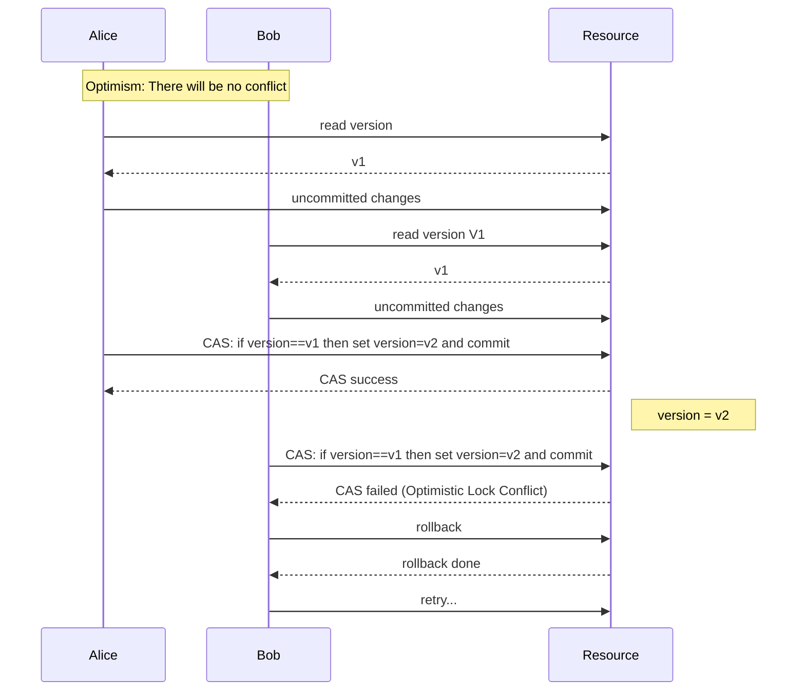

## Optimistic Lock

```mermaid
sequenceDiagram
    participant Alice
    participant Bob
    participant Resource

    Note over Alice,Bob: Optimism: There will be no conflict

    Alice->>Resource: read version
    Resource-->>Alice: v1

    Alice->>Resource: uncommitted changes

    Bob->>Resource: read version V1
    Resource-->>Bob: v1

    Bob->>Resource: uncommitted changes

    Alice->>Resource: CAS: if version==v1 then set version=v2 and commit
    Resource-->>Alice: CAS success
    Note right of Resource: version = v2

    Bob->>Resource: CAS: if version==v1 then set version=v2 and commit
    Resource-->>Bob: CAS failed (Optimistic Lock Conflict)

    Bob->>Resource: rollback
    Resource-->>Bob: rollback done

    Bob->>Resource: retry...

```

## Pessimistic Lock

exclusive access
